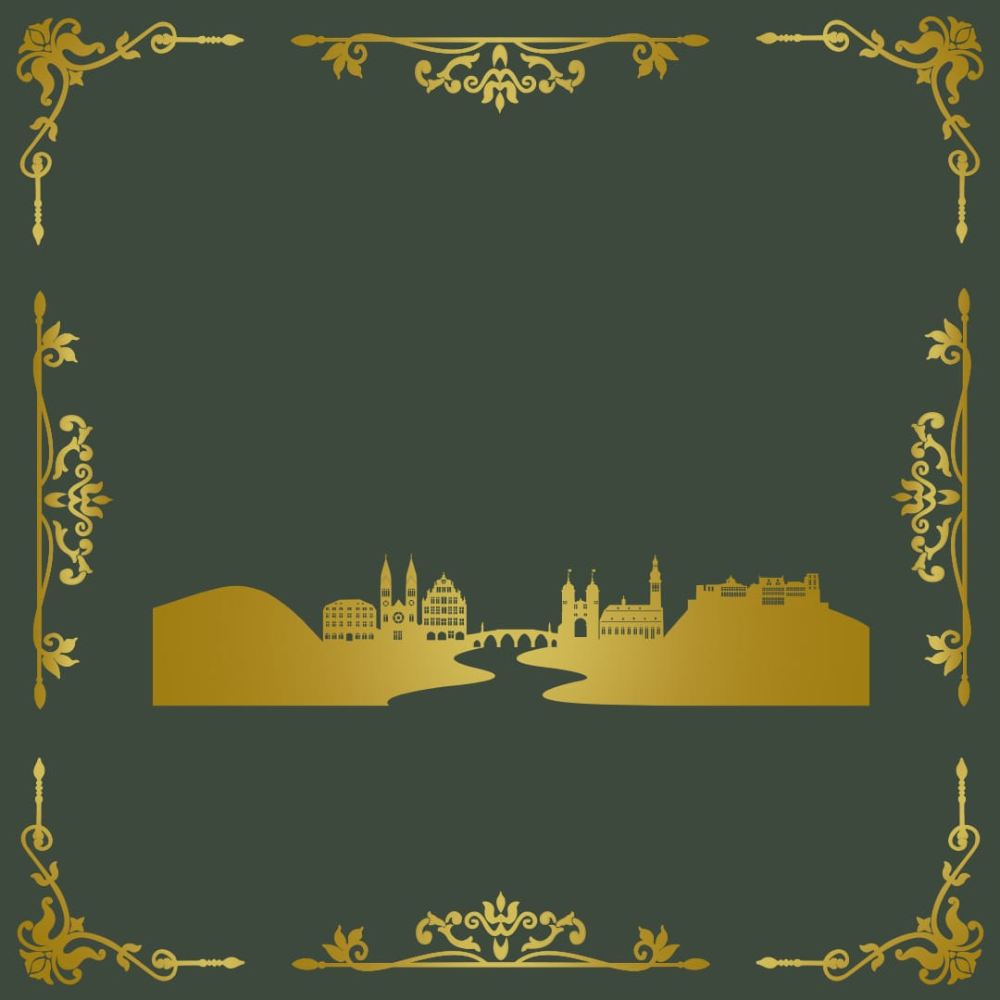
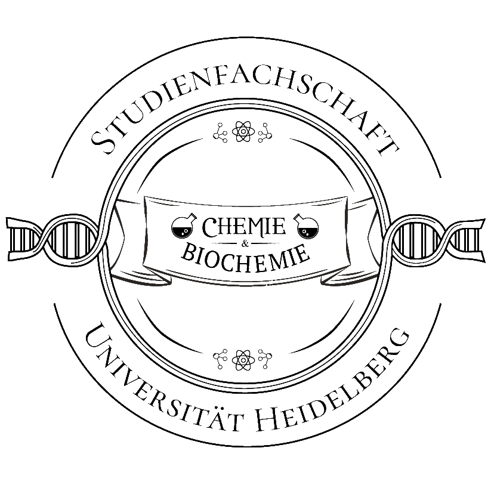
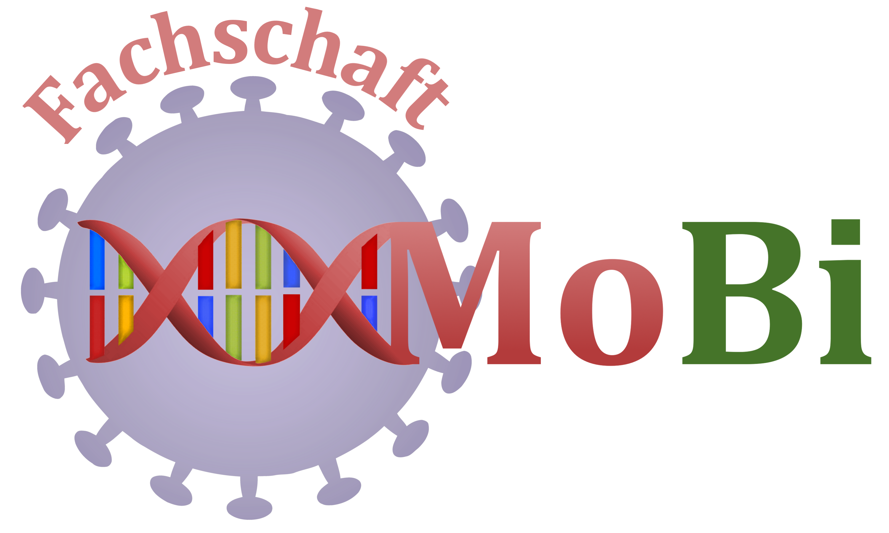
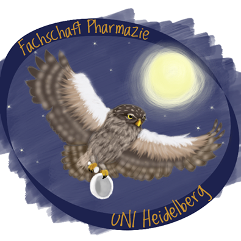

<html>
	<head>
		<title>Naturwissenschaftsball Heidelberg</title>
		<meta charset="utf-8" />
		<meta name="viewport" content="width=device-width, initial-scale=1, user-scalable=no" />
		<link rel="stylesheet" href="assets/css/main.css" />
		<noscript><link rel="stylesheet" href="assets/css/noscript.css" /></noscript>
	</head>
	<body class="landing is-preload">

		<!-- Page Wrapper -->
			

				<!-- Header -->
					<header id="header" class="alt">
						<h1 class="nwb_gradient"><a href="index.html">Naturwissenschaftsball</a></h1>
						<nav id="nav">
							<ul>
								<li class="special">
									<a href="#menu" class="menuToggle"></a>
									

										<ul class="nwb_gradient">
											<li><a href="index.html">Home</a></li>
											<li><a href="gallery2020/gallery2020.html">Galerie</a></li>
                                            						<!-- <li><a href="https://feedback.naturwissenschaftsball.de/index.php/452582?lang=de-informal">Feedback</a></li>-->
											<li><a href="http://www.stura.uni-heidelberg.de/impressum/">Impressum</a></li>
										</ul>
									

								</li>
							</ul>
						</nav>
					</header>

				<!-- Banner -->
					<section id="banner">
						

							<h2 class="nwb_gradient">III. Naturwissenschaftsball</h2>
							<b>
26. / 27. April 2024 
							Schloss Heidelberg
</b>
							
						

						<a href="#one" class="nwb_gradient more scrolly">Mehr Infos</a>
					</section>

				<!-- One -->
					<section id="one" class="wrapper style1 special">
						

							

								<h2>Tanzball im Königssaal</h2>
								
Lasst uns am <b>26. / 27. April 2024</b> von 19:00 - 02:00 Uhr gemeinsam das Tanzbein schwingen! Alle wichtigen Informationen findet ihr demnächst hier auf unserer Website. 

                                
                                #<h4>Programm des Abends</h4>
		#
Wird noch veröffentlicht.

                                
<!--                                 
<b>Tickets</b> erhaltet ihr ab dem 15.04.2024 für 35€ bei euren Fachschaften.
 -->
							

							<!-- <ul class="icons major"> -->
								<!-- <li>Lorem</li> -->
								<!-- <li>Ipsum</li> -->
								<!-- <li>Dolor</li> -->
							<!-- </ul> -->
						

					</section>

					
<!-- 					<section id="tanzkurs" class="wrapper style2 special">
						

								<header class="major">
										<h3>Tanzkurs</h3>
										
Um eure Tanzfertigkeiten aufzufrischen, bieten wir euch erstmals zwei Tanzkurse an.
										  Diese finden am <b>07.12.2019 </b> für ChaChaCha, Rumba und langsamen Walzer und   am <b>14.12.2019</b> für Discofox, Tango und Wiener Walzer   jeweils ab <b>13:30 Uhr</b> im Hörsaalzentrum Chemie (INF 252) statt.  Außerdem laden wir euch anschließend ab 16 Uhr zum freien Tanzkreis ein.  Bitte bringt zum Tanzkurs auch eure Eintrittskarten mit. 
										

	</header>
				

</section> -->

                    <!-- Anfahrt mit Karte -->
					<section id="Anfahrt" class=" wrapper style2">
						

							

								
									

									<!--iframe width="80%" height="100%" frameborder="0" scrolling="no" marginheight="0" marginwidth="0" src="https://www.openstreetmap.org/export/embed.html?bbox=8.669156,49.414726,8.673088,49.416848&amp;layer=mapnik&amp;marker=49.41574,8.67112" style="border: 1px solid black"></iframe-->
                                    <iframe width="80%" height="100%" frameborder="0" scrolling="no" marginheight="0" marginwidth="0" src="https://www.openstreetmap.org/export/embed.html?bbox=8.713957965373995%2C49.410172181975284%2C8.716012537479402%2C49.411179123708095&amp;layer=mapnik&amp;marker=49.41067478285702%2C8.714985251426697" style="border: 1px solid black"></iframe>
									

								
                                

                                <h3>Anfahrt & Parken</h3>
                                Alle 20 Minuten fährt die Buslinie 33 vom Bismarckplatz zur Haltestelle Rathaus-Bergbahn. 
                                 
                                Von dort aus sind es ca. 15 Minuten Fußweg den Berg hinauf zum Schloss.
                                 
                                Wer mit dem Auto anreist, kann auf einem <a href="https://www.google.com/maps/place/Parking/@49.4124446,8.7195984,16.46z/data=!4m5!3m4!1s0x4797c1af4c04679d:0xa1f37b21b747c8b4!8m2!3d49.4124394!4d8.7202096" target="blank">Parkplatz</a> in der Nähe des Schlosses parken.
                                

							

                            
						

					</section>

				<!-- One -->
                <!--<section id="sponsoren" class="wrapper style1 special">
                        

                            <header class="major">
                                <h3>Sponsoren</h3>
                                
Der Ball wird von folgenden Unternehmen unterstützt:

                                <ul style="background:white; padding: 20px;">
                                
                                
                                
                                </ul>
                </section>-->
				<!--	<section id="fundsachen" class="wrapper style1 special">
						

							<header class="major">
								<h3>Fundsachen</h3>
								
Liegengebliebene Jacken/Regenschirme können bei der <a href="https://fschemie.stura.uni-heidelberg.de/" target="blank">Fachschaft Chemie und Biochemie</a> 
								  bis zum <b>30.01.2019</b> mit einer Beschreibung des Objekts abgeholt werden.  
								Danach wird alles an das <b>Fundbüro der Stadt Heidelberg</b> weitergegeben.

                                
                                <h4>Folgende Sachen wurden gefunden:</h4>
                                <table style="width:450px; margin:auto; margin-bottom:-50px;">
                                <tr>
                                    <td>3 Regenschirme</td>
                                </tr>
                                <tr>
                                    <td>1 Jackett</td>
                                </tr>
                                <tr>
                                    <td>1 Schal</td>
                                </tr>
                                </table>
				</section>-->
                                
                    

                    <!-- CTA -->
					<section id="cta" class="wrapper style4">
						

							
						

                        
					</section>
                    
				<!-- Footer -->
					<footer id="footer">
                        
							
						
						<ul class="copyright">
                            <li style="line-height: 2em">Der Naturwissenschaftsball ist eine gemeinsame Veranstaltung der Fachschaften <a href="http://www.fsbio.de/" target="blank">Biologie</a>, <a href="https://fschemie.stura.uni-heidelberg.de/" target="blank">Chemie und Biochemie</a>, <a href="https://mathphys.fsk.uni-heidelberg.de/w/" target="blank">MathPhysInfo</a>, <a href="https://www.fachschaft.mobi/" target="blank">Molekulare Biotechnologie</a> und <a href="http://www.pharmaziestudenten-hd.de/" target="blank">Pharmazie</a> als Teil der <a href="http://www.stura.uni-heidelberg.de">Verfassten Studierendenschaft</a> der  <a href="https://www.uni-heidelberg.de/" target="blank">Universität Heidelberg</a></li>
                        </ul>
                        <ul style="background:#ccc">
                        
                        
                        
                        
                        
                        </ul>
                        <ul class="copyright">
			<li><a href="mailto:info@naturwissenschaftsball.de" class="icon fa-envelope-o">Email&nbsp; info@naturwissenschaftsball.de</a></li><li><a target="_blank" rel="noopener noreferrer" href="https://www.stura.uni-heidelberg.de/impressum/">Impressum</a></li><li>Design: <a href="http://html5up.net">HTML5 UP</a></li>
						</ul>
					</footer>

			

		<!-- Scripts -->
			
			
			
			
			
			
			

	</body>
</html>
